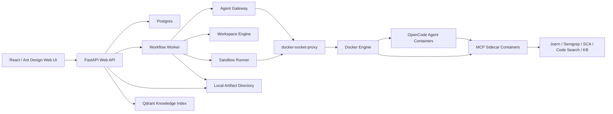

# DieAudit

[](https://github.com/D1no209/DieAudit/actions/workflows/ci.yml)
[](LICENSE)

DieAudit is a local-first, Docker-orchestrated multi-agent code audit platform.
It is designed to run practical security review workflows against real source
projects with OpenCode agents, MCP tool sidecars, Joern CPG analysis, Semgrep,
SCA, finding-specific markdown workspaces, validator fan-out, PoC generation,
verification, judgement, and report artifacts.

The project is still early, but the repository is intentionally structured as a
runnable open-source platform rather than a one-off demo.

## What DieAudit Does

- Imports projects from Git URLs or zip uploads.
- Creates isolated workspaces and local artifact directories.
- Builds Joern CPG context for code structure, call-chain, and source-to-sink
  analysis.
- Runs OpenCode-based agents through Agent Client Protocol.
- Starts Agent containers and MCP sidecars through Docker orchestration.
- Assigns each finding its own persistent folder and `finding.md` handoff file.
- Lets Source-Sink Finder, Validator, Judger, PoC Writer, and PoC Verifier
  iteratively refine the same finding markdown.
- Runs per-finding Agent Swarm stages in parallel with configurable concurrency.
- Records Findings, Evidence, ValidationAttempts, AgentRuns, ContainerRuns, and
  report artifacts.
- Provides a React + Ant Design web UI for projects, audit runs, findings,
  reports, runtime state, sandbox controls, knowledge documents, and admin keys.

## Architecture



Core services in `docker-compose.yml`:

- `nginx`: Web/API gateway.
- `web-ui`: React frontend.
- `web-api`: FastAPI backend.
- `workflow-worker`: audit pipeline worker and optional Temporal worker.
- `agent-gateway`: Agent, ACP, MCP, and runtime package orchestration.
- `workspace-engine`: project import, snapshots, and static workspace work.
- `sandbox-runner`: controlled target/PoC Docker execution.
- `kb-indexer`: document parsing and vector indexing.
- `postgres`, `redis`, `nats`, `qdrant`, `temporal`.
- `docker-socket-proxy`: limited Docker Engine API proxy.

Default artifact storage is local directory mounts under `data/artifacts`.
MinIO is not part of the default Compose topology.

## Current Production Path

The intended audit flow is:

```text
project import
  -> snapshot
  -> Joern CPG build
  -> recon / orchestrator
  -> code-auditor fan-out
  -> Semgrep + SCA
  -> per-finding Source-Sink Finder
  -> per-finding Validator
  -> per-finding Judger
  -> per-finding PoC Writer
  -> per-finding PoC Verifier
  -> markdown/json reports
  -> runtime cleanup
```

CodeQL is not required by the default production path. Joern is the default CPG
engine and should be available for real audits.

## Quick Start

Requirements:

- Docker Desktop or Docker Engine with Compose v2.
- PowerShell on Windows, or Bash on Linux/macOS.
- Optional: a local Docker/HTTP proxy. This repository defaults to:
  - host-side pulls: `http://127.0.0.1:7897`
  - container build args: `http://host.docker.internal:7897`

Windows:

```powershell
copy .env.example .env
.\scripts\bootstrap.ps1
docker compose --profile core up -d
```

Linux/macOS:

```bash
cp .env.example .env
./scripts/bootstrap.sh
docker compose --profile core up -d
```

Open:

- Web UI: <http://localhost:8080>
- Web API health: <http://localhost:18000/health>
- Agent Gateway health: <http://localhost:18001/health>
- Temporal UI: <http://localhost:18088>

Create a persisted admin API key:

```powershell
.\scripts\create-api-key.ps1 -Name bootstrap-admin -Scope admin
```

```bash
NAME=bootstrap-admin SCOPES=admin ./scripts/create-api-key.sh
```

The command prints the API key once. Use it as `X-DieAudit-Api-Key` in the UI
or API clients.

## Tool Images

Build the default tool images before real audits:

```powershell
$env:HTTP_PROXY = "http://127.0.0.1:7897"
$env:HTTPS_PROXY = "http://127.0.0.1:7897"
docker compose --profile tools build tool-mcp-image tool-mcp-joern-image opencode-agent-image
```

Linux/macOS:

```bash
HTTP_PROXY=http://127.0.0.1:7897 \
HTTPS_PROXY=http://127.0.0.1:7897 \
docker compose --profile tools build tool-mcp-image tool-mcp-joern-image opencode-agent-image
```

If you do not use a proxy, leave the proxy variables empty.

## Running An Audit

1. Start the `core` profile.
2. Open the Web UI.
3. Add an API key if authentication is enabled.
4. Import a Git project or upload a zip project from the `Projects` page.
5. Go to `Audit Runs`.
6. Click `启动审计`.
7. Configure:
   - enabled Agent stages,
   - Validator rounds,
   - per-stage concurrency,
   - Agent template names,
   - Joern query packs,
   - pre-guidance prompt,
   - runtime retention and network options.
8. Create the AuditRun.
9. Click `一键闭环` to run the full pipeline.
10. Review Findings, per-finding markdown, Evidence, ValidationAttempts, PoC
    results, and Reports.

Each finding has a stable artifact folder and a `finding.md` file. Finding
scoped agents are instructed to read and update that markdown file, so the
finding history is preserved across Source-Sink Finder, Validator, Judger, PoC
Writer, and PoC Verifier stages.

## Runtime Safety Model

- The application services do not mount `/var/run/docker.sock` directly.
- `agent-gateway` and `sandbox-runner` access Docker through
  `docker-socket-proxy`.
- Dynamic containers are labeled with `dieaudit.managed=true`,
  `dieaudit.audit_run_id`, `dieaudit.project_id`, `dieaudit.role`, and
  `dieaudit.ttl`.
- Each AuditRun gets a dedicated Docker network named
  `dieaudit-run-{audit_run_id}`.
- Workspaces are mounted read-only for agents and tools where possible.
- PoC containers default to no external network unless explicitly allowed.
- `retain_runtime_on_failure=true` keeps failed runtime state for debugging.

DieAudit executes untrusted code and AI-generated PoCs inside Docker containers.
Do not expose a local deployment to untrusted users without additional network,
host, authentication, and resource isolation.

## Knowledge Base

The knowledge base accepts PDF, MHTML, HTML, Markdown, and text documents.
Documents are chunked and indexed into Qdrant.

Default embeddings use a deterministic local hash provider so development
Compose can run without an external embedding service. For semantic retrieval,
configure an OpenAI-compatible embedding endpoint:

```env
KNOWLEDGE_EMBEDDING_PROVIDER=openai-compatible
KNOWLEDGE_EMBEDDING_BASE_URL=https://embedding-provider.example/v1
KNOWLEDGE_EMBEDDING_API_KEY=...
KNOWLEDGE_EMBEDDING_MODEL=text-embedding-3-small
KNOWLEDGE_VECTOR_SIZE=1536
KNOWLEDGE_COLLECTION_NAME=dieaudit_knowledge_embeddings_v1
KNOWLEDGE_EMBEDDING_PROBE_ON_READINESS=true
```

Use a fresh Qdrant collection or reindex documents when changing embedding
dimension or provider.

## Configuration

Copy `.env.example` to `.env` for local development.
Use `.env.production.example` as a deployment checklist.

Important production settings:

- `DIEAUDIT_API_KEY` or persisted API keys for authentication.
- `PUBLIC_METRICS=false` unless metrics are separately protected.
- `ENABLE_DEMO_TEMPLATES=false`.
- `PIPELINE_EXECUTION_BACKEND=workflow-worker` for the stable durable queue, or
  `PIPELINE_EXECUTION_BACKEND=temporal` to start audit runs through Temporal.
- `DEFAULT_SANDBOX_RUNTIME=runc`.
- `ALLOW_RUNC_SANDBOX=true`.
- `ALLOW_SANDBOX_EXTERNAL_NETWORK=false`.
- `ARTIFACT_STORAGE_BACKEND=local`.

Check readiness:

```powershell
Invoke-RestMethod http://localhost:8080/gateway/runtime/readiness | ConvertTo-Json -Depth 10
```

```bash
curl -s http://localhost:8080/gateway/runtime/readiness | jq .
```

More details are in [docs/production-readiness.md](docs/production-readiness.md).

## Temporal Status

Temporal is available as an execution backend. When
`PIPELINE_EXECUTION_BACKEND=temporal`, `/run-pipeline` starts a Temporal
workflow on `TEMPORAL_TASK_QUEUE`. The workflow runs the main audit pipeline as
stage-level Temporal activities:

`joern-cpg -> agent-audit -> code-analysis -> sca -> semgrep -> source-sink-analysis -> validators -> judgement -> poc-writing -> poc-verification -> report -> cleanup`.

The default `workflow-worker` backend still uses the existing durable database
queue and `PipelineExecutor` path. Temporal mode does not enqueue into that
database queue.

Finding-level Swarm stages are also Temporal-aware. Source-Sink Finder, Judger,
PoC Writer, and PoC Verifier run one activity per Finding, bounded by their
`max_parallel_*` settings. Validators run one activity per Finding/round,
bounded by `max_parallel_validators`.

Current limitation: these fan-outs are Temporal activities, not child
workflows. A future hardening pass can add per-agent retry policies,
idempotency keys, and stronger activity heartbeat semantics.

## Demo Profile

Demo and mock runtime surfaces are intentionally opt-in.
Demo fixtures are intentionally excluded from the default startup path.
The default bootstrap and startup path does not build or expose mock demo images unless explicitly requested.

Windows:

```powershell
echo ENABLE_DEMO_TEMPLATES=true >> .env
.\scripts\bootstrap.ps1 -IncludeDemo
docker compose --profile core up -d
```

Linux/macOS:

```bash
echo ENABLE_DEMO_TEMPLATES=true >> .env
./scripts/bootstrap.sh --include-demo
docker compose --profile core up -d
```

Production template APIs should not expose mock templates when
`ENABLE_DEMO_TEMPLATES=false`.

## Development

Python:

```powershell
python -m pip install -r services\platform\requirements.txt
python -m pip install -r services\mcp-tools\requirements.txt
python -m pip install pytest pytest-asyncio requests-mock time-machine
python -m pytest
python -m compileall services\platform\app services\mcp-tools services\agents\opencode-agent
```

Frontend:

```powershell
cd services\web-ui
npm ci
npm run build
```

Compose validation:

```powershell
docker compose --profile core config --services
docker compose --profile tools config --services
```

E2E smoke scripts:

```powershell
.\scripts\e2e-smoke.ps1
```

```bash
./scripts/e2e-smoke.sh
```

The E2E scripts can skip real model execution when no model API key is
configured.

## Repository Layout

```text
configs/                    Agent, MCP, model, nginx templates
docs/                       operational documentation
scripts/                    bootstrap, key creation, E2E, image pull helpers
services/platform/          FastAPI backend, ORM, runtime orchestration
services/web-ui/            React + Ant Design frontend
services/mcp-tools/         MCP tool server implementation and tool images
services/agents/            OpenCode agent image
services/mock-*             opt-in demo fixtures
tests/                      Python and repo-structure tests
```

## Roadmap

Near-term engineering work:

- More real-world end-to-end fixture audits.
- Stronger Joern query packs per language/framework.
- Better sandbox target stack management.
- More precise dependency vulnerability normalization.
- Production-grade RAG embedding provider documentation.
- Runtime resource quotas and metrics dashboards.
- Hardening around multi-user authorization scopes.

## Contributing

Contributions are welcome. See [CONTRIBUTING.md](CONTRIBUTING.md).

For security reports, see [SECURITY.md](SECURITY.md).

## License

DieAudit is licensed under the GNU General Public License v3.0.
See [LICENSE](LICENSE).
