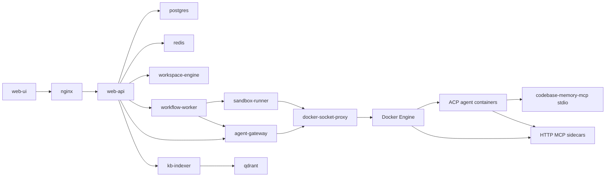

# DieAudit Architecture

DieAudit is a split-service, Docker-orchestrated audit platform. The current
production path uses ACP agents, sidecar MCP tool servers, and ACP-injected
stdio MCP servers for local graph context.

## Service Boundaries



- `web-api` owns the external HTTP API and dashboard-facing data aggregation.
- `workflow-worker` owns durable audit pipeline execution.
- `agent-gateway` owns dynamic agent containers, MCP sidecars, runtime
  packages, and scoped runtime API keys.
- `workspace-engine` owns project import, snapshot creation, and bootstrap
  structure discovery.
- `sandbox-runner` owns controlled target and PoC execution.
- `kb-indexer` owns document extraction, embedding, and Qdrant indexing.
- `services/platform-common` holds shared domain, schema, settings, security,
  event, and persistence primitives used by split services.

The legacy single-platform image remains as a compatibility envelope while the
split services mature, but new architecture work should target these service
boundaries.

## Agent Runtime Model

Agent templates declare ACP runtime metadata and required MCP names. The
gateway starts the requested agent image, mounts the workspace and runtime
package, then passes task input plus MCP definitions to the shared ACP runner.

Enabled production agent images:

- `dieaudit/kimi-code-agent:local`

Runtime-specific command selection is driven by template protocol fields and
adapter registry entries, not by hard-coded platform logic.

## MCP Model

DieAudit uses two MCP shapes:

- HTTP/SSE sidecars for platform-hosted tools such as filesystem, code search,
  Semgrep, SCA, KB, HTTP test, sandbox, and Whiteboard.
- ACP stdio MCP injection for local agent-only tools, currently
  `codebase-memory-mcp`.

`codebase-memory-mcp` is intentionally not wrapped as an HTTP sidecar. The
gateway sends this neutral MCP definition through `MCP_SERVERS_JSON`:

```json
{
  "codebase-memory-mcp": {
    "transport": "stdio",
    "command": "codebase-memory-mcp",
    "args": [],
    "env": {
      "CBM_CACHE_DIR": "/artifacts/codebase-memory"
    }
  }
}
```

The ACP runner converts it to `schema.McpServerStdio` and passes it into
`new_session(..., mcp_servers=...)`. Runtime packages may record this definition
for auditability, but stdio MCPs are not written into runtime-specific local
MCP configuration.

Agents should call `index_repository` for `/workspace` when graph context is
needed or missing, use `get_architecture` before broad planning, and use
`search_graph`, `trace_path`, `query_graph`, `get_code_snippet`,
`detect_changes`, and `search_code` for focused security analysis.

## Pipeline Flow

The workflow-worker pipeline follows this production flow:

```text
project import
  -> snapshot
  -> structure discovery
  -> orchestrator / recon
  -> code-auditor fan-out
  -> Semgrep + SCA
  -> Whiteboard Swarm
     -> selectively scheduled Trace Worker / Validator / Judger / PoC work
  -> validation judgement
  -> feedback loop
  -> PoC writing
  -> PoC verification
  -> report
  -> cleanup
```

There is no pre-agent graph build stage. Graph context is agent-driven through
`codebase-memory-mcp`. Decompilation remains a source preparation step; produced
source roots are described in `STRUCTURE.md` and can be indexed by agents when
they need graph context.

There is also no separate top-level source-sink analysis stage in the current
production pipeline. Source-to-sink chains are trace evidence produced by
Whiteboard Swarm scheduled Trace Worker runs when the controller identifies a
finding that needs deeper reachability analysis.

## Whiteboard Collaboration

Each AuditRun has a Whiteboard graph backed by database records and snapshots
under `data/artifacts/whiteboards/{audit_run_id}/whiteboard.json`.

Agents use `whiteboard-mcp` to:

- create observations, source/sink hints, validation results, judgement notes,
  PoC plans, and verification cards;
- link supporting or contradicting evidence;
- declare gaps when another stage should produce a predecessor or successor;
- schedule additional agent work through auditable platform requests.

Whiteboard state is shared coordination data, not a replacement for persisted
Findings, Evidence, ValidationAttempts, PoC artifacts, or final reports.

## Removed Legacy Paths

The current architecture does not use a graph sidecar, pre-agent graph build,
query-pack stage, or production Temporal backend. CodeQL remains optional and
experimental rather than part of the default production path.
